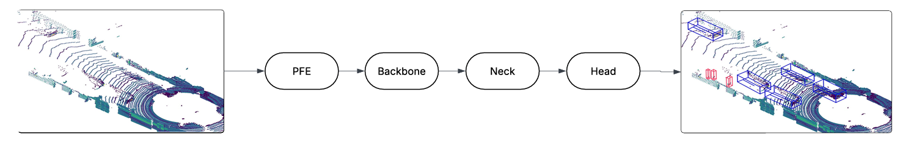

# MobilePointPillars: Lightweight Network for Object Classification using LiDAR Point Clouds

> **Bachelor Thesis Project**
> * **Author:** Mohamed Motawea
> * **Supervisors:** Dr. Moheb Mekhael, Eng. Amr Khaled
> * **Institution:** German International University (GIU), Engineering Faculty
> * **Submission Date:** 05 Jan, 2026

---

## 📖 Abstract

This repository hosts the implementation of **MobilePointPillars**, a lightweight variant of the PointPillars architecture designed for deployment on resource-constrained edge devices like FPGAs.

The rapid evolution of Autonomous Driving Systems (ADS) requires perception modules that are both highly accurate and deterministic. While LiDAR sensors provide rich geometric data, processing sparse, unordered point clouds is computationally intensive. This project addresses the challenge of migrating high-performance 3D object detection from GPU workstations to energy-efficient embedded platforms (AMD Xilinx Zynq UltraScale+ MPSoC).

By replacing the standard backbone with **MobileNetV1** and introducing a **geometric-aware PFE**, we achieved a **78.1% reduction in computational complexity** (down to 7.52 GMACs) and an **89% reduction in parameter count**, with less than a 2% drop in mAP after quantization.

---

## 🏗️ System Architecture & Methodology



The system evolves the standard PointPillars architecture through three key optimizations:

### 1. Lightweight Backbone Optimization
The primary bottleneck in the baseline architecture was the 2D Convolutional Backbone, which accounted for ~30 GMACs per frame.
* **Solution:** We replaced the heavy VGG-based backbone with **MobileNetV1** utilizing **Depthwise Separable Convolutions**.
* **Impact:** This split operation (Depthwise + Pointwise) reduced the backbone's computational load from **29.71 GMACs to 2.46 GMACs**.

### 2. Geometric Feature Enhancement ($z_r$)
Lightweight backbones often struggle with feature extraction for small, non-rigid objects. Early experiments showed high false positives for pedestrians (confused with tree trunks).
* **Solution:** We enriched the Pillar Feature Encoder (PFE) by adding a **10th Handcrafted Feature**: the **height-to-area ratio ($z_r$)**.
* **Formula:** $z_r = \frac{\text{Height of points in pillar}}{\text{Area of points}}$
* **Result:** This restored vertical context lost during pillarization, significantly improving pedestrian detection reliability.

### 3. Optimized Neck Design
The standard Transposed Convolutions in the Neck module introduced checkerboard artifacts and were inefficient for hardware implementation.
* **Solution:** Replaced with **Upsample (Nearest Neighbor) + Depthwise Separable Convolutions**.
* **Benefit:** Maximizes MAC efficiency on FPGA DSP slices and eliminates irregular memory access patterns associated with zero-insertion in transposed convolutions.

---

## ⚙️ FPGA Hardware Acceleration Strategy

The system is designed for the **Xilinx Zynq UltraScale+ MPSoC**, utilizing a heterogeneous architecture where the CPU handles pre-processing (Voxelization) and the FPGA fabric handles the heavy neural network inference.

### Hybrid Quantization Scheme
To accommodate the high dynamic range of LiDAR intensity data while minimizing bandwidth:
* **Weights:** Quantized to **Static Int8** (Per-channel symmetric).
* **Activations:** Kept at **Int16** to preserve sparse feature fidelity.
* **Biases:** Stored as **Int64** to prevent accumulation overflow.

### Accelerator Design
* **Dataflow:** The FPGA accelerator uses **Output-Stationary** dataflow to minimize off-chip memory access.
* **Structure:** Composed of $N$ 1D Processing Element (PE) arrays. This vector-based organization flexibly supports both standard and depthwise convolutions, unlike rigid 2D systolic arrays.

---

## 📊 Performance Benchmarks

All results are evaluated on the **KITTI Validation Set**. The optimized configuration is denoted as **ID6** in the thesis.

### 1. Accuracy vs. Complexity (Config ID6 vs. Baseline ID1)

| Metric | Baseline (VGG) | **MobilePointPillars (ID6)** | Reduction / Change |
| :--- | :--- | :--- | :--- |
| **Backbone** | Standard VGG-based | **MobileNetV1** | - |
| **Complexity** | 34.38 GMACs | **7.52 GMACs** | **-78.1%** |
| **Parameters** | 4.83 Million | **0.51 Million** | **-89.4%** |
| **3D mAP (Car)** | 76.74% (Mod) | **62.01%** (Mod) | -14.7% |
| **BEV mAP (Car)**| 87.91% (Mod) | **78.29%** (Mod) | -9.6% |

> **Analysis:** While there is a drop in mAP, the **ID6** configuration offers the optimal trade-off for embedded systems, achieving massive computational savings while maintaining functional detection capabilities for safety-critical classes.

### 2. Quantization Robustness

The transition from Floating Point (FP32) to Hybrid Quantization (Int8/Int16) showed negligible degradation, proving the model's suitability for integer-only hardware.

| Metric | TFLite (FP32) | **TFLite Quantized (Int8/16)** | Delta |
| :--- | :--- | :--- | :--- |
| **2D mAP (Easy)** | 73.82% | **75.41%** | +1.59% |
| **3D mAP (Mod)** | 51.86% | **53.14%** | +1.28% |
| **Model Size** | 2.07 MB | **0.73 MB** | **-64.7%** |

### 3. Latency & The Pre-processing Bottleneck
Our analysis identified a structural "Hard Ceiling" in CPU-based pre-processing. Even with an instant neural network, the system is limited by data ingestion.

* **Voxelization Time:** 2.07 ms
* **Pillar Feature Encoding (PFE):** 36.00 ms (CPU) vs 8.73 ms (GPU)
* **Conclusion:** Real-time (>30Hz) performance requires offloading the PFE and Voxelization stages to dedicated FPGA logic, as they currently consume ~38ms on standard CPUs.

---

## 💻 Installation

Install the package and dependencies:

```bash
cd PointPillars/
pip install -r requirements.txt
python setup.py build_ext --inplace
pip install .
